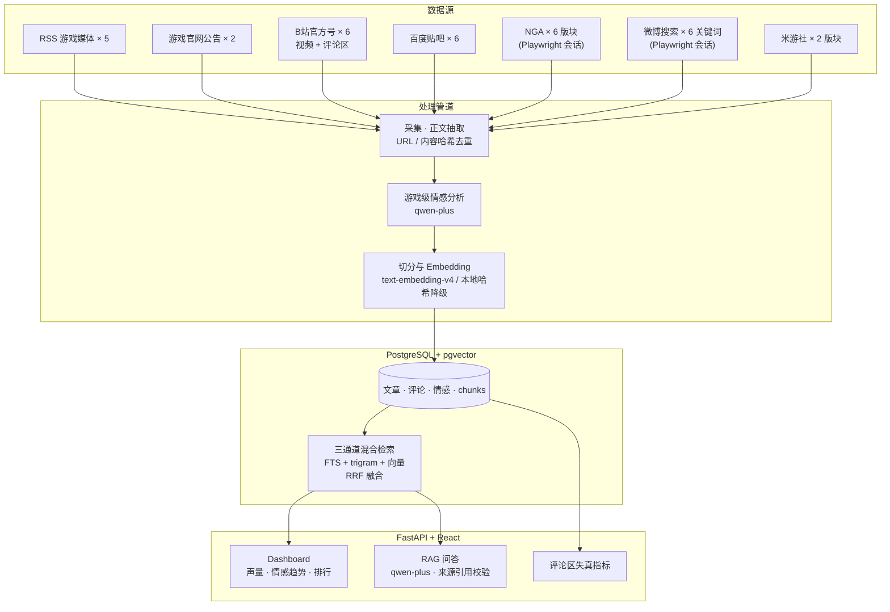
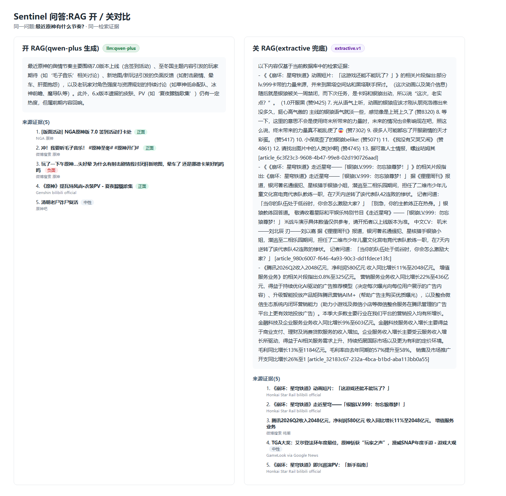

# Sentinel-AI

> Chinese Anime Game Intelligence Platform

面向国产二次元游戏的舆情分析平台。Sentinel-AI 自动采集新闻、官方公告与玩家社区舆论（B站官方号评论区、贴吧、NGA、微博搜索、米游社），进行游戏级情感分析，并提供带来源引用的 RAG 问答与评论区失真检测。

它不是通用聊天机器人：所有回答均以平台已采集的内容为证据来源，证据不足时会明确说明。

> 项目状态：核心闭环已可运行（采集 → 清洗去重 → 情感分析 → 索引 → Dashboard / RAG 问答 / 失真检测）。

## 架构



NGA 与微博需要登录态：用 `python scripts/login.py --site nga|weibo` 扫码登录一次，会话落盘到 `sessions/`，采集器通过 Playwright 复用。详见 [docs/login-sessions.md](docs/login-sessions.md)。

## Demo


带引用的 RAG 问答演示（约 25 秒）：提问、检索证据、生成答案并逐条校验引用。



同一问题开 / 关 RAG 的回答对比：右侧为无 LLM 的抽取式兜底（检索片段直接堆砌，漂移且冗长），左侧为 qwen-plus 生成（连贯归纳并锚定来源）。

## 快速开始

```bash
cp .env.example .env
docker compose up -d --build
# 前端 http://localhost:5173,后端 API http://localhost:8000/api/v1
```

可选配置：

- **LLM / Embedding**：默认走阿里百炼（OpenAI 兼容接口）。在 `.env` 中配置 `OPENAI_API_KEY` 即可，`LLM_BASE_URL` 默认为 `https://dashscope.aliyuncs.com/compatible-mode/v1`,`LLM_MODEL=qwen-plus`、`EMBEDDING_MODEL=text-embedding-v4`。不配 key 时系统退化为本地哈希 embedding + 抽取式回答，仍可完整跑通。
- **登录源（NGA / 微博）**:`python scripts/login.py --site nga|weibo` 扫码登录，会话保存到 `sessions/`（依赖见 `scripts/requirements-login.txt`)。不登录则这两个源跳过。

全部环境变量说明见 [docs/environment.md](docs/environment.md)。

## 数据规模（当前实测）

| 指标 | 数值 |
| --- | --- |
| 文章总数 | 1120（官方 153 / 媒体 299 / 聚合 289 / 社区 379) |
| 玩家评论 | 7751(B站 / 贴吧 / NGA) |
| 向量 chunks | 986 |
| 情感标注 | 1198 条（qwen-plus，正面 / 中性 / 负面） |
| 覆盖游戏 | 6：原神、崩坏：星穹铁道、鸣潮、明日方舟、明日方舟：终末地、少女前线2：追放 |
| 数据源 | RSS 媒体 5、官网 2、B站官方号 6、贴吧 6、NGA 6 版、微博搜索 6 词、米游社 2 版 |

## 监控游戏

| 游戏 | Topic ID |
| --- | --- |
| 原神 | `genshin-impact` |
| 崩坏：星穹铁道 | `honkai-star-rail` |
| 鸣潮 | `wuthering-waves` |
| 明日方舟 | `arknights` |
| 明日方舟：终末地 | `arknights-endfield` |
| 少女前线2：追放 | `girls-frontline-2-exilium` |

游戏名称、别名、关键词与采集源统一维护在 `config/topics.yaml` 和 `config/sources.yaml`;同一篇文章可关联多个游戏。

## 检索与评测

混合检索为 FTS + trigram + 向量三通道 RRF。Union-pool 标注评测显示 rerank 与多 query 扩展均未带来收益，剩余差距主要在语料覆盖而非排序质量；且每次扩充语料会使 union 目标池移动，nDCG@10 是更稳定的进度指标。方法、实测数字与操作命令见 [docs/retrieval.md](docs/retrieval.md) 和 [docs/evaluation/](docs/evaluation/)。

## 文档

- [docs/retrieval.md](docs/retrieval.md) — 混合检索实现与评测基线
- [docs/evaluation/](docs/evaluation/) — 评测问题集、标注与运行记录
- [docs/login-sessions.md](docs/login-sessions.md) — NGA / 微博登录会话管理
- [docs/data-quality.md](docs/data-quality.md) — 数据质量规则
- [docs/api.md](docs/api.md) — API 契约
- [docs/environment.md](docs/environment.md) — 环境变量与配置
- [docs/README.md](docs/README.md) — 文档总索引
