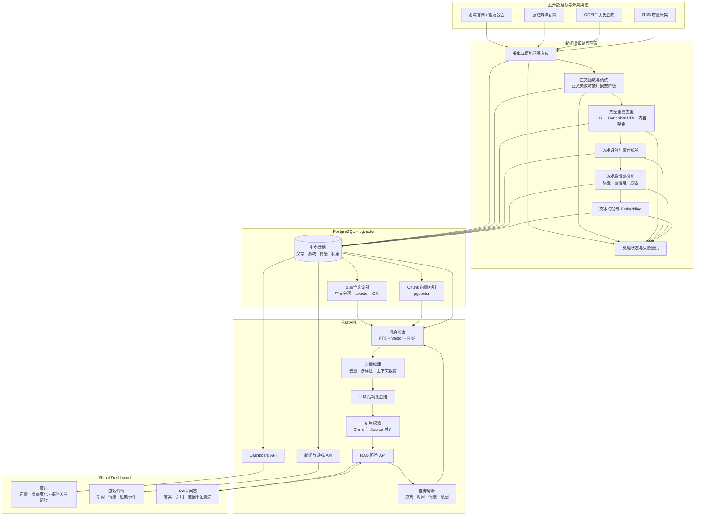

# Sentinel-AI

> Chinese Anime Game Intelligence Platform

面向国产二次元及泛二次元游戏的新闻与官方公告舆情分析平台。Sentinel-AI 自动采集公开新闻和公告，分析游戏级舆情变化，并通过带来源引用的 RAG 问答帮助用户理解近期事件。

它不是通用聊天机器人：所有回答均以平台已采集的新闻与公告为证据来源。

> 项目状态：V1 规划与工程搭建阶段。

## V1 目标

在一个月内交付一个完整、可运行、可评测的核心闭环：

```text
新闻 / 官方公告采集
        ↓
正文抽取、清洗、去重
        ↓
游戏识别、内容标签、游戏级情感分析
        ↓
PostgreSQL + pgvector 索引
        ↓
Dashboard 趋势展示
        ↓
Hybrid RAG 问答与来源引用
```

## 监控游戏

| 游戏 | Topic ID |
| --- | --- |
| 原神 | `genshin-impact` |
| 崩坏：星穹铁道 | `honkai-star-rail` |
| 绝区零 | `zenless-zone-zero` |
| 鸣潮 | `wuthering-waves` |
| 明日方舟 | `arknights` |
| 明日方舟：终末地 | `arknights-endfield` |
| 少女前线 2：追放 | `girls-frontline-2-exilium` |
| 王者荣耀 | `honor-of-kings` |
| 第五人格 | `identity-v` |
| 无畏契约 | `valorant` |
| 三角洲行动 | `delta-force` |

游戏名称、别名、关键词、官方站点和采集源统一维护在 `config/topics.yaml`。同一篇文章可以关联多个游戏；例如涉及厂商、联动或竞争关系的报道。

## 数据范围

### V1 包含

- 游戏官网与官方公告
- 游戏媒体新闻，例如 GameLook、游研社、游戏葡萄、3DM
- GDELT 或其他公开新闻数据的历史回填
- RSS 或公开源的增量采集

### V1 暂不包含

- 微博、B 站评论、NGA、TapTap、小红书等社区内容
- 复杂爬虫、反爬绕过和浏览器自动化
- 多 Agent、实时告警、PDF 报告、用户权限和后台配置系统

## 系统架构



## 核心能力

### 新闻情报管道

1. 采集新闻与官方公告，提取标题、正文、来源、时间和原始链接。
2. 对相同 URL、canonical URL、RSS 重复推送及高度相似正文进行完全重复去重。
3. 识别文章涉及的游戏，保存相关度与命中关键词。
4. 以“对目标游戏的影响倾向”为定义进行游戏级情感分析，而非仅判断文章语气。
5. 切分文章正文、生成 embedding，并建立全文与向量索引。

不同媒体对同一事件的报道会保留：它们是新闻声量、交叉验证与后续事件分析的重要证据。

### Dashboard

- 今日新增新闻数
- 新闻声量与负面新闻趋势
- 热门游戏排行
- 各游戏正面、中性、负面占比
- 最新新闻与来源链接
- 按游戏、情感、来源和时间范围筛选的新闻列表

### Evidence-grounded RAG

示例问题：

- `最近鸣潮为什么负面增加？`
- `原神最近有哪些重要公告？`
- `无畏契约过去七天有哪些重要事件？`

回答仅依据已入库文章生成。每个主要事实都必须关联来源；证据不足时系统会明确说明，而不会编造结论。

## 混合检索

Sentinel-AI 使用 PostgreSQL Full-Text Search 和 pgvector 实现混合检索：

```text
用户问题
  ↓
解析游戏、时间范围、情感条件和意图
  ↓
PostgreSQL 元数据过滤
  ↓
Full-Text Search Top 20 + Vector Search Top 20
  ↓
Reciprocal Rank Fusion (RRF)
  ↓
按文章去重，选择 Top 6–10 个证据片段
  ↓
LLM 生成结构化回答并校验引用 ID
```

全文检索基于 `tsvector`、`websearch_to_tsquery` 和 GIN index；语义检索基于 `pgvector`。这种组合既覆盖精确游戏名称和公告术语，也能召回语义相近的报道。

## 数据模型

| 表 | 用途 |
| --- | --- |
| `topics` | 游戏主题、名称、别名与关键词 |
| `articles` | 原文、来源、URL、时间、哈希与处理状态 |
| `article_topics` | 文章与多个游戏之间的关联、相关度和命中词 |
| `article_sentiments` | 同一文章对不同游戏的影响倾向与解释 |
| `article_chunks` | 文本分块、token 数与向量 |

情感结果至少包括 `label`、`score`、`confidence`、`reason` 和 `model_name`。文章的处理过程可追踪为：

```text
discovered → fetched → cleaned → classified → embedded → indexed
```

失败时记录错误原因、重试次数和处理时间，以支持从失败步骤恢复。

## 技术栈

| 层级 | 技术 |
| --- | --- |
| Backend | FastAPI + SQLAlchemy |
| Frontend | React + TypeScript + Vite |
| Database | PostgreSQL + pgvector |
| Retrieval | PostgreSQL Full-Text Search + pgvector + RRF |
| LLM | OpenAI API 或兼容接口 |
| Deployment | Docker Compose |
| Testing | pytest + Vitest |

## 项目结构

```text
Sentinel-AI/
├── backend/                 # FastAPI 服务
│   ├── app/
│   │   ├── api/             # 新闻、Dashboard、问答接口
│   │   ├── collectors/      # RSS、公告、GDELT 采集
│   │   ├── processing/      # 清洗、去重、主题与情感分析
│   │   ├── rag/             # 切分、Embedding、检索、引用校验
│   │   ├── models/          # 数据模型与迁移
│   │   └── services/        # 领域服务
│   └── tests/
├── frontend/                # React 应用
├── config/                  # topics.yaml 与环境配置
├── scripts/                 # 历史回填与手动采集脚本
├── docs/                    # 架构图、截图、Demo GIF、评测报告
├── docker-compose.yml
├── .env.example
└── README.md
```

## API（规划）

| 方法 | 路径 | 说明 |
| --- | --- | --- |
| `GET` | `/api/health` | 健康检查 |
| `GET` | `/api/news` | 按游戏、情感、时间、来源检索新闻 |
| `GET` | `/api/news/{id}` | 新闻详情 |
| `GET` | `/api/dashboard/summary` | Dashboard 概览 |
| `GET` | `/api/dashboard/trends` | 声量与情感趋势 |
| `POST` | `/api/ask` | 带引用的 RAG 问答 |
| `POST` | `/api/ingest` | 手动采集，仅开发环境或 API Key 保护下启用 |

`POST /api/ask` 将返回结构化答案、结论及其引用、来源列表、查询条件、检索信息和证据不足标记，方便前端逐条展示与核验。

## 评测目标

V1 将提供人工标注问题集与相关文档标注，至少评测：

- 数据规模：1,000+ 篇相关新闻与公告
- 检索：Recall@K、nDCG@K
- 引用：Citation Correctness、Citation Coverage、Citation Relevance
- 情感分类：游戏级标签准确率与人工抽样一致性
- 工程质量：后端单元测试、前端组件测试、Docker Compose 一键运行

## 设计文档

V1 的数据库、API、UI、Prompt、环境变量与 CI 标准见 [docs/README.md](docs/README.md)。
## 开发路线图

- [ ] 初始化 FastAPI、React、PostgreSQL/pgvector 与 Docker Compose
- [ ] 创建游戏主题配置和数据库模型
- [ ] 实现公告/新闻采集、正文抽取与重复去重
- [ ] 实现游戏识别、标签与游戏级情感分析
- [ ] 实现 PostgreSQL FTS、pgvector 和 RRF 混合检索
- [ ] 完成 Dashboard 与新闻详情页
- [ ] 完成带引用的 RAG 问答与引用校验
- [ ] 补充评测集、测试、截图和 Demo GIF

## V2 方向

- 接入 NGA、TapTap、B 站评论、知乎、Reddit 等社区数据
- 事件聚类与版本更新分析
- Agent Tool Calling 与自动化周报
- 社区情感变化追踪与自动预警

## Resume Highlights

> Built an end-to-end news intelligence pipeline for Chinese anime-style games.
>
> Implemented hybrid retrieval using PostgreSQL Full-Text Search and pgvector with Reciprocal Rank Fusion.
>
> Developed an evidence-grounded RAG system with source citation and structured retrieval.
>
> Deployed the system using FastAPI, React, PostgreSQL and Docker Compose.