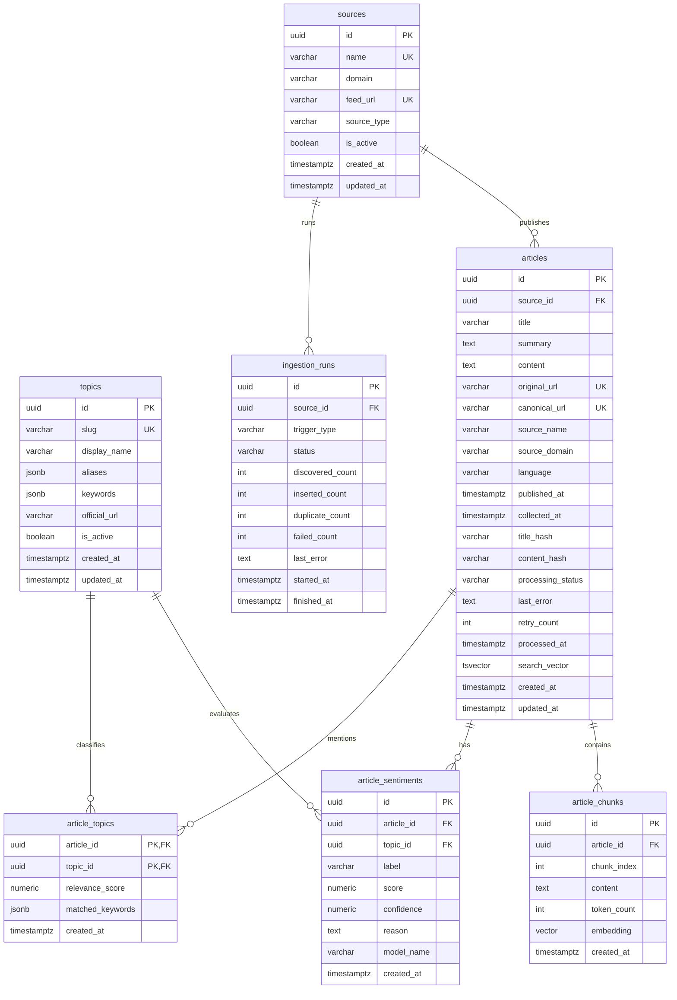

# V1 Database ER Diagram

PostgreSQL 是 V1 的唯一持久化数据库，启用 `pgvector` 扩展。所有时间字段使用 `timestamptz` 并存储 UTC；主键使用 UUID；枚举值由应用层与数据库 `CHECK` 约束共同限制。



## Table Contract

### `topics`

游戏监控主题。`slug` 是稳定 API 标识，如 `genshin-impact`；显示名、别名与关键词由 `config/topics.yaml` 同步。禁止在业务代码硬编码关键词。

### `sources` and `ingestion_runs`

`source_type` 仅允许 `official`、`media`、`gdelt`、`rss`。每次回填或增量采集创建一条 `ingestion_runs` 记录，用于审计数据量、失败原因和重试。

### `articles`

`original_url` 保存采集地址，`canonical_url` 保存规范化后的最终地址。`processing_status` 仅允许：`discovered`、`fetched`、`cleaned`、`classified`、`embedded`、`indexed`、`failed`。

完全重复的定义是相同原始 URL、canonical URL，或相同内容哈希。同一事件的不同媒体报道必须保留。

`search_vector` 由 `title`（高权重）、`summary` 和 `content`（普通权重）生成。中文全文检索使用部署环境确认可用的中文分词扩展；若不可用，必须在部署文档中声明采用的 tokenizer 与局限。

### `article_topics`

一篇文章可以涉及多款游戏。`relevance_score` 范围为 0–1；`matched_keywords` 保存命中的别名或关键词。复合主键 `(article_id, topic_id)` 防止重复关联。

### `article_sentiments`

情感是文章对某个目标游戏的影响倾向，不是文章语气。`label` 仅允许 `positive`、`neutral`、`negative`；`score` 范围为 -1 到 1；`confidence` 范围为 0 到 1。唯一约束为 `(article_id, topic_id, model_name)`。

### `article_chunks`

每个 chunk 在一篇文章内的 `chunk_index` 唯一。`embedding` 维度必须与 `EMBEDDING_DIMENSIONS` 一致；模型迁移时不得混用不同维度的向量。

## Required Constraints and Indexes

```sql
CREATE EXTENSION IF NOT EXISTS vector;

CREATE UNIQUE INDEX uq_articles_canonical_url
  ON articles (canonical_url) WHERE canonical_url IS NOT NULL;
CREATE INDEX ix_articles_published_at ON articles (published_at DESC);
CREATE INDEX ix_articles_status ON articles (processing_status);
CREATE INDEX ix_article_topics_topic_article ON article_topics (topic_id, article_id);
CREATE INDEX ix_sentiments_topic_label ON article_sentiments (topic_id, label);
CREATE INDEX ix_articles_search_vector ON articles USING GIN (search_vector);
CREATE INDEX ix_chunks_article_index ON article_chunks (article_id, chunk_index);
CREATE INDEX ix_chunks_embedding_hnsw ON article_chunks
  USING hnsw (embedding vector_cosine_ops);
```

Use database migrations (Alembic) for every schema change. Never apply ad-hoc production DDL manually.